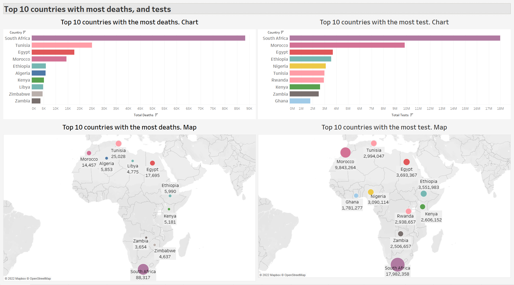
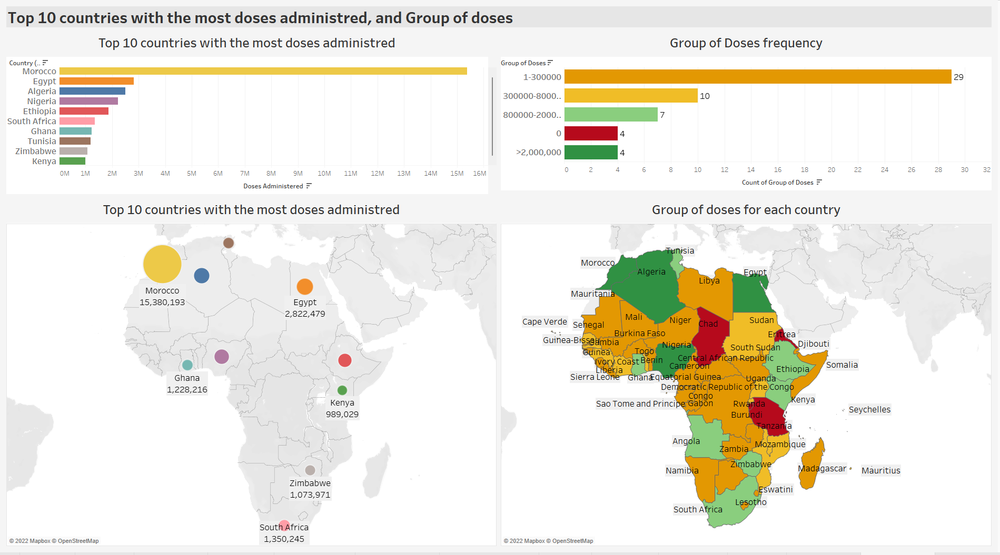

# Covid-19 in African countries. SQL and Tableau analyses

This project examines perceptions, insights and finding out the main features of the Covid-19 in African countries.

## Datasets

- [“African Covid cases”](https://www.kaggle.com/datasets/johnfisayo/african-covid-cases)
- [“Coronavirus (COVID-19) Vaccination in Africa”](https://www.kaggle.com/datasets/malcolm95/covid19-vaccination-in-africa)

*Both were published in 2021*

## Questions

- Which countries had the worst situation at that time?
- Do more people get infected in countries with larger populations?
- Do the countries with more cases have more deaths?
- Do the countries where more tests are conducted show more cases?
- Do the countries close to each other have similar infection levels or number of cases?* In order to answer this question, most of the visualizations include Tableau maps.
- Does vaccination cause a decrease in infections and a health improvement?

## Tools

- SQLite
- Tableau
- Visual Studio Code
- Git
- Github repository

## SQL Queries

[SQL queries](africa_covid_vac_analysis.sql)

## Insights

1. Finding main ratios and general information

2. Top 10 most populous countries and Top 10 countries with the most total cases

1. Top 10 countries with the most highest number of deaths and Top 10 countries with the highest number of total tests

4. Top 10 countries with the most covid 19 recovered cases and Top 10 countries with the most active cases

5. Top 10 countries with the most doses administered and group of doses

6. Top ten countries with the most active cases and recovered, taking into account Group of doses

7. Further analysis on ratios

The parameters for comparison with World average were taken from this article [Covid19 in Africa and Clustering](https://www.kaggle.com/code/sasakitetsuya/covid19-in-africa-eda-and-clustering), dataset published in 2021 too. Please note that this is a secondary source. The primary source is informed in the above mentioned article.

